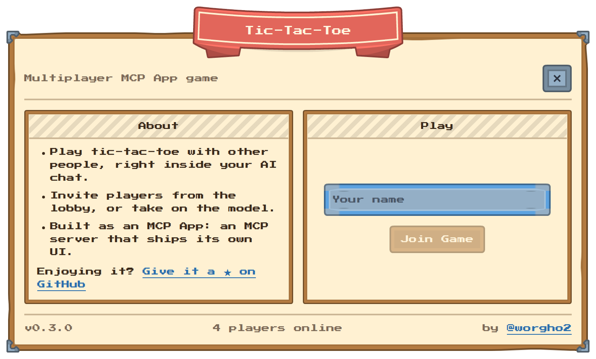
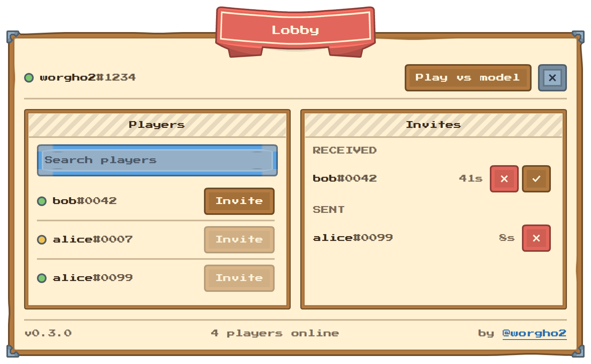
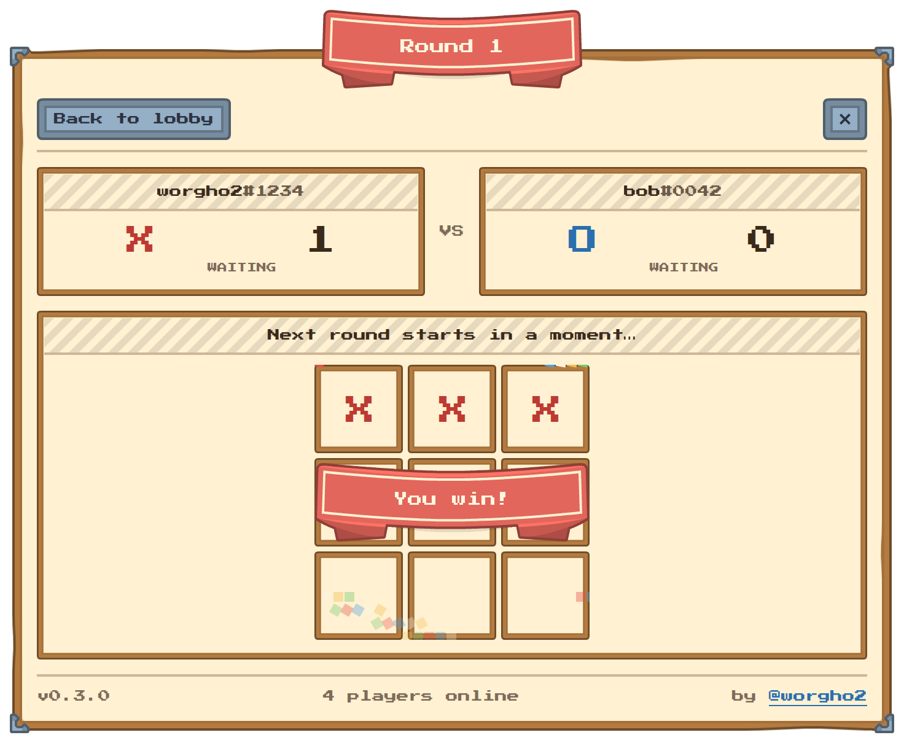
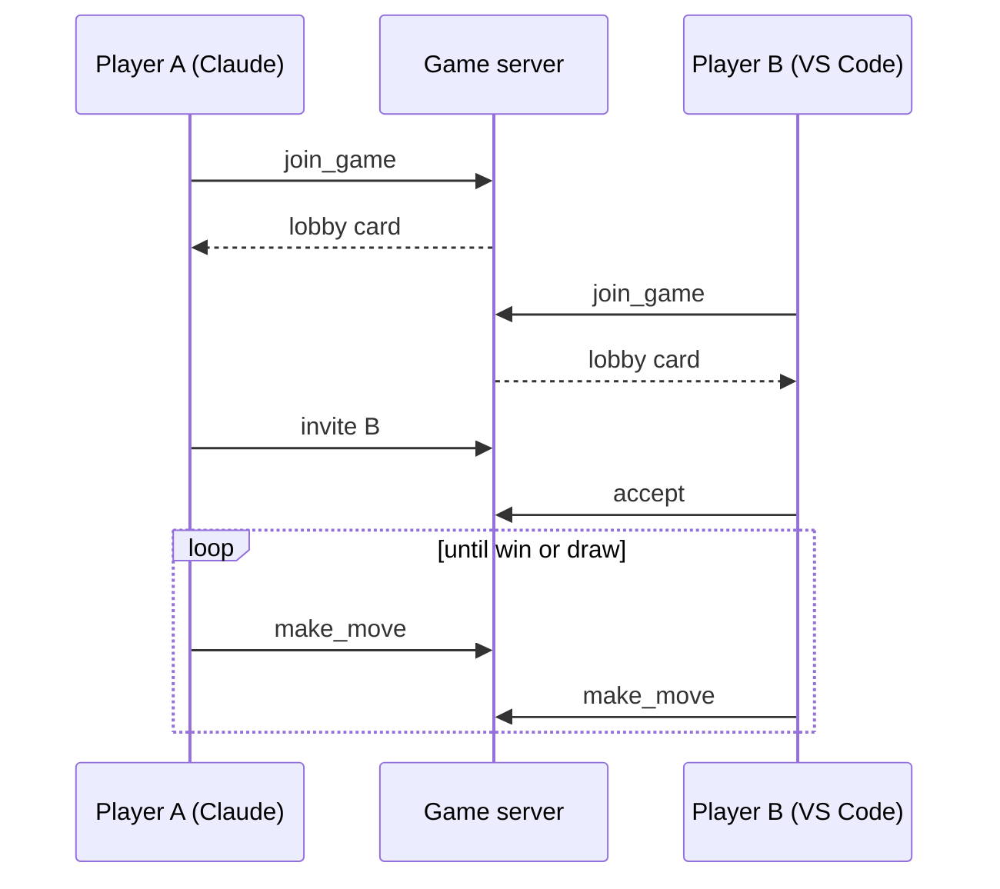

# Tic-Tac-Toe, played inside your AI chat

> Challenge a friend to tic-tac-toe without leaving Claude, ChatGPT or VS Code. No app, no account, no browser tab. The board shows up right in the conversation.

<p align="center">
  
  
  
</p>

## What is this?

AI chat clients can now run small interactive apps inside a conversation, through an open standard called [MCP Apps](https://github.com/modelcontextprotocol/ext-apps). Most examples are dashboards and forms. This one is a game.

You ask your assistant to play tic-tac-toe. A lobby card appears in the chat. Your friend does the same in *their* chat, possibly in a completely different client. You see each other in the lobby, send an invite, and play on a shared board, turn by turn, each inside your own conversation.

Everything runs on one tiny server at `tic-tac-toe-mcp-game.obfsoft.party`. It only knows the names players type in and forgets everything when a game ends.

## Play now

You need two people, each with an MCP-capable chat client. Both follow the same steps.

**1. Connect the game server.** The address is:

```
https://tic-tac-toe-mcp-game.obfsoft.party/mcp
```

| Client | How to add it |
|---|---|
| Claude (web or desktop) | Settings → Connectors → *Add custom connector*, paste the address above. |
| VS Code | `code --add-mcp '{"name":"tic-tac-toe","type":"http","url":"https://tic-tac-toe-mcp-game.obfsoft.party/mcp"}'` |
| ChatGPT | Settings → Connectors → *Create* (developer mode), paste the address above. |
| Other clients | Any host that supports MCP Apps over Streamable HTTP. See the [clients list](https://modelcontextprotocol.io/clients). |

**2. Open the lobby.** Say something like *"Let's play tic-tac-toe"*. The assistant calls the `join_game` tool and the lobby card renders in the chat.

**3. Pick a name.** Type a display name and join the lobby. Your friend does the same.

**4. Invite and play.** You will see each other listed: a green dot means free to play, yellow means already in a match. One of you hits *Invite*, the other accepts with ✓ (✕ declines). The player who sent the invite is X and goes first. Tap a cell on your turn; the opponent's move shows up within a couple of seconds. Names can repeat: everyone gets a `#1234` tag, so look for the full handle. Invites expire after a minute.

**5. Rematch.** When a round ends the next one starts by itself after a moment, with X and O swapped and the score kept. *Back to lobby* ends the match for both of you.

**Play against your assistant.** Alone? Hit *Play vs model* in the lobby. After each of your moves the widget posts a short message in the chat asking the assistant for its move, and the assistant answers by calling the `model_move` tool. The server only checks the rules; how well the assistant plays is entirely up to the model. If it goes quiet, *Ask again* re-sends the request. This needs a client that declares the MCP Apps `message` capability; the button stays hidden elsewhere.

**Done for now?** The × at the top right of the card closes your session for good. Reopening the game in that chat needs a fresh `join_game`, which prevents a stale card from lingering as a second player.



## How does it work?

- **Two tools the assistant sees.** `join_game` opens the widget; `model_move` lets the assistant play when you asked it to.
- **A widget in a sandbox.** The board is a single self-contained HTML file served by the server as a `ui://` resource. The host renders it in a sandboxed iframe and relays messages between the widget and the server.
- **Ten tools the widget uses.** Setting a name, inviting, accepting, moving and leaving are tools too, but they are marked *app-only*, so the assistant never sees them and cannot play on your behalf.
- **Polling, not push.** MCP Apps has no server-to-widget push channel yet, so the widget asks for the latest state every 1.5 seconds. That is why an opponent's move takes a moment to appear.
- **Nothing is stored.** The lobby lives in memory on a single server. Players who go quiet for 30 seconds are dropped (a reload just asks for your name again), and a finished game is forgotten once both players leave.

## Run it yourself

The server is published as a Docker image on every release, for both x86-64 and ARM (Apple Silicon, Raspberry Pi):

```bash
docker run --rm -p 8765:8765 ghcr.io/worgho2/tic-tac-toe-mcp-game:latest
```

Then point your client to `http://localhost:8765/mcp`. Both players need to reach the same server, so expose it (for example with a Cloudflare tunnel) if your friend is not on your network.

To hack on it, see [CONTRIBUTING.md](CONTRIBUTING.md).

## Status

This is a proof of concept. It shows that a real-time, two-player experience can live inside an AI conversation using only the MCP Apps standard. The game rules, the look of the board and the lobby flow are the next things to iterate on.

Built with the [MCP Apps SDK](https://github.com/modelcontextprotocol/ext-apps), the [MCP TypeScript SDK](https://github.com/modelcontextprotocol/typescript-sdk), React and Vite.

## License

[MIT](LICENSE)
